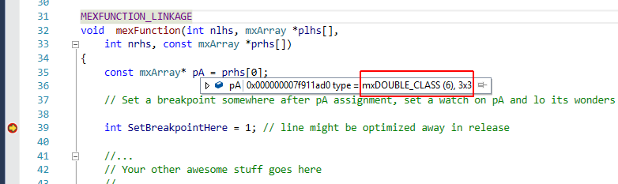
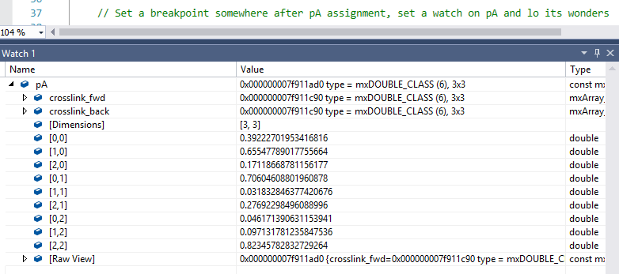
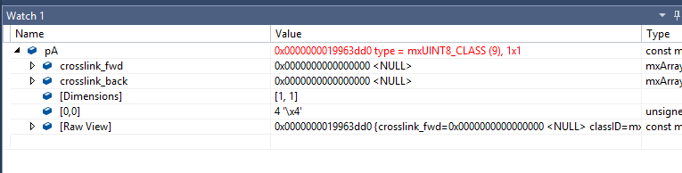
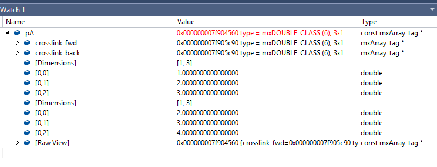
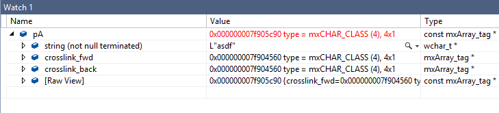
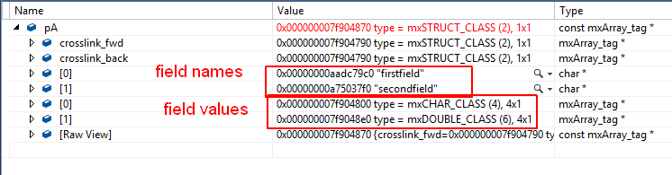
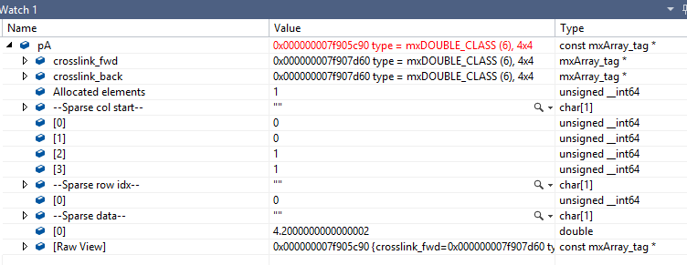

# Watching mxArray Contents within Visual Studio

mxArray is the main type that Matlab uses to expose functionality to external native code. It is the input/output both to mex files and to compiler-generated functions.

mxArray is an opaque type, defined in matrix.h as -
```cpp
typedef struct mxArray_tag mxArray;
```
and so setting a regular watch on it while debugging (either mex files or calls to compiled components) results in a null watch. An intervention is in order.

The code in this project is a [natvis file](https://msdn.microsoft.com/en-us/library/jj620914.aspx) customizing the VS debugger to show some of the mxArray contents when setting a watch on an mxArray variable. It also contains a sample mex code, used for demonstration of this enhanced debugging view. To use this natvis in your own project just include it as one of your project files.


## Getting Started

There are various ways to demonstrate debugging with the mxArray watch. Here's one:

1. Build the project (it is recommended in DEBUG as watching variables would be easier),
2. Copy the output ToyMex.mexw64 to somewhere in your Matlab path, OR from Matlab `cd` to the
folder containing this mex.
3. From VS, *attach* to Matlab (Debug / Attach to Process)
4. Set a breakpoint somewhere in mexFunction
5. in the Matlab command window, type something like -
```
>> A = rand(3)
>> ToyMex(A)
```

When hovering above the received `mxArray` variable during VS debugging, you should see something like: 
When setting a watch on thesame variable, you should see something like:

If you were to send a matrix of uint8's, you'd get: 

.. and similarly for other built in types.


You can also watch complex variables - the 1st array is the real component and the 2nd is the imaginary one:  


Strings (although the VS debugger expects them to be null-terminated, and they're not): 

Structs - again, the field names and contents are stored in separate buffers and so (at least for now) are displayed separately: 

If you understand the internals of [sparse matrix storage](https://www.mathworks.com/help/matlab/matlab_external/matlab-data.html#f47606), you can view sparse matrix contents as well: 

Single cells are supported too, cell arrays and struct arrays - not yet. More generally, this work is based on rough reversing that was sufficient for my needs and is still very partial. Moreover, `mxArray`'s layout is known to be prone to change between matlab versions. Current natvis has been tested with Matlab 2016a, 2016b & 2017a, but we believe it should work with at least 2014+ versions.

You're very encouraged to play around with this toy sample. Before you rebuild with your changes
remember to 'clear mex' in Matlab - otherwise it might prevent you from replacing the mex file.


(c) Ofek Shilon 2017
